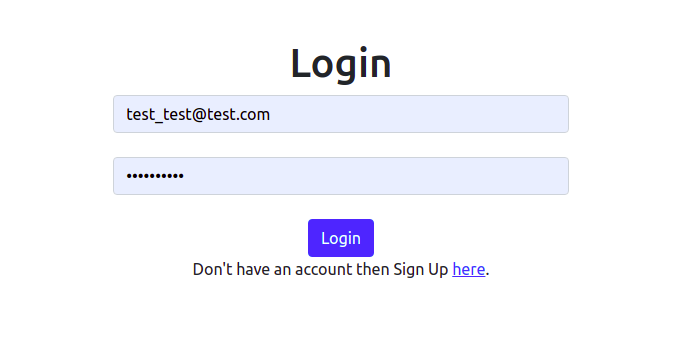
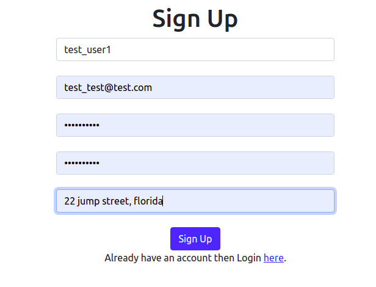
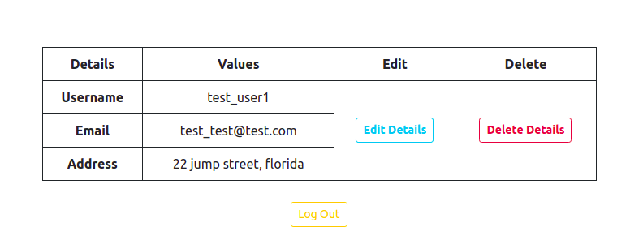
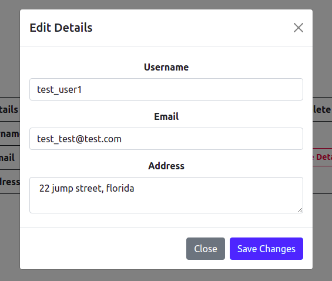

# Nemesis
Task given by Nemesis Consultants LLP for Python Development internship\
\
Task completed without JWT authentication.

# TASK

 Screen 1: Login Form\
1.Email (Input)\
2.Password (Input)\
3.Login Button\
4.SignUp Link\
\
\
Screen 2: Sign Up Form\
1.Username\
2.Email\
3.Password\
4.Confirm Password\
5.Address\
\
\
Screen 3: User Detail Page\
1.All User Detail except password will be shown in table\
\
\
2.There will be edit and delete option in every row.\
3.On Edit option a modal will be option where user details will be edited\
\
\
4.On delete user details will be deleted\
5.Logout option
